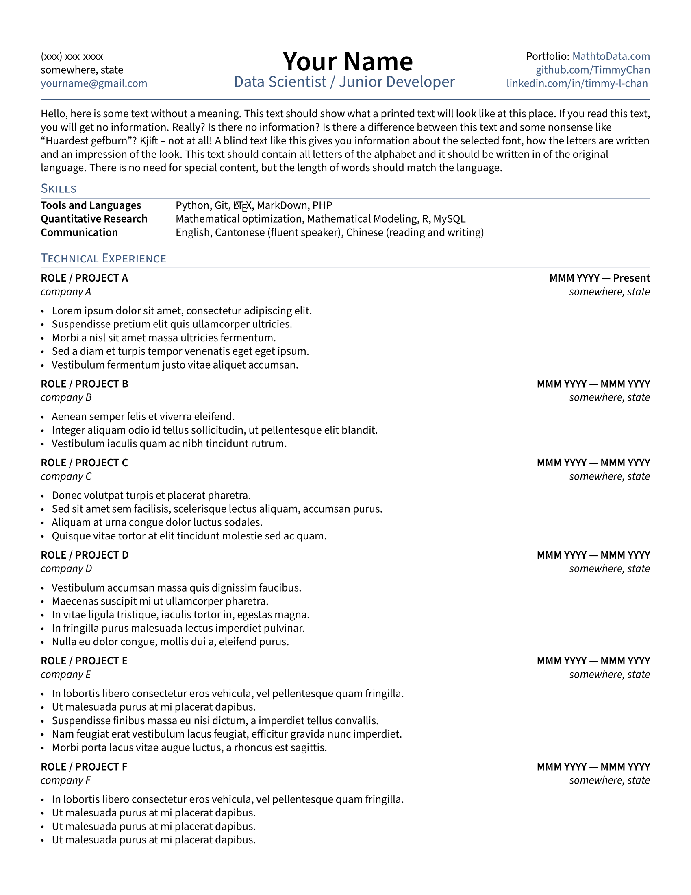
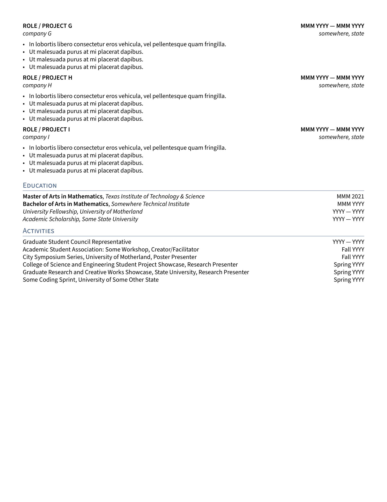

# data-science-tech-resume-template

## OFFICIAL PUBLIC OVERLEAF TEMPLATE

https://www.overleaf.com/latex/templates/data-science-tech-resume-template/zcdmpfxrzjhv

Applicant tracking system (ATS), especially older ones, do not like PDFs that have links in them. If such an issue arises, simply take the output pdf and print to another pdf, which would be the quickest way to remove "active contents" in the file. 

Update: *Note that for resumes, best practice is to keep the length to be one page; however, due to popular demand this template was updated to allow for multiple pages.*

Resume template for data scientists, a complement to data-science-tech-cover-letter-template:
https://www.overleaf.com/latex/templates/data-science-tech-cover-letter-template/gbrcqktbsfxf

### Files:

- resume.tex: Main file
- \_header.tex: header code
- TLCresume.sty: style file containing formatting details
- section/objective: https://www.indeed.com/career-advice/resumes-cover-letters/resume-objective-examples
- section/skills: table of skills
- section/experience: projects or roles
- section/education: schools and stuff
- section/activities: optional, could comment out in resume.tex.

### Editor:

https://github.com/TimmyChan
https://www.linkedin.com/in/timmy-l-chan/

### Contributors:

- https://github.com/xiazeyu
- https://github.com/iamgmujtaba
- https://github.com/alejlatorre

### Last Updated: Oct 19th, 2025

